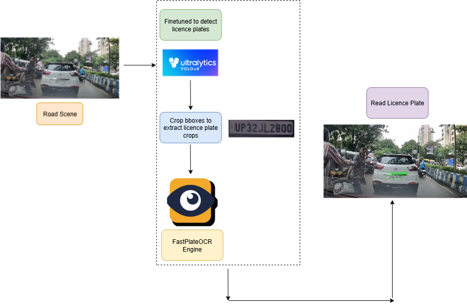

# 🚓📸 RearEye-YOLOv8n-FastPlateOCR-For-OnRoad-Licence-Plate-Reading
This repo is a successful attempt at replicating the licence plate reading systems that are mounted upon police patrol vehicles. It employs a 2 stage pipeline - Firstly, a YOLOv8n instance is finetuned to localize licence plates on road scenes which is fed downstream to the FastPlateOCR API which reads the digits on the plate.

# Demo 👇
<video src="demo.mp4" controls width="640"></video>
[[Link to Demo]](https://youtu.be/bTiBW0bzcz8 "Click to watch")

# Overview of the pipeline


## 🚀 Features

* **Finetuned YOLOv8n**: Accurate licence plate localization **Precision = 0.954, Recall = 0.963, mAP@50 = 0.973**.
* **FastPlateOCR**: Another **open source project** that offers pre-trained models for **licence plate style OCR**.
---

## 📂 Project Structure

```bash
.
├── demo_test/                # some test images for inference.
├── requirements.txt          # Python dependencies.
├── plate_train_YOLO.ipynb    # script which finetunes yolov8n on the licence plate dataset for 35 epochs.
├── plate_inf_yolo.ipynb      # script which infers from the trained yolov8n instance on the above specified test images.
├── demo.py                   # A Streamlit demo of the entire project.
├── plate_detect_config.yaml   # yaml file specifying the training recipie.
├── full_inf_pipeline.ipynb    # script which runs the entire licence plate reading pipeline: localization --> recognition/reading.
├── v2_35epochs.pt             # checkpoint which should be downloaded from the link specified under 'project dependencies'.
```

---
